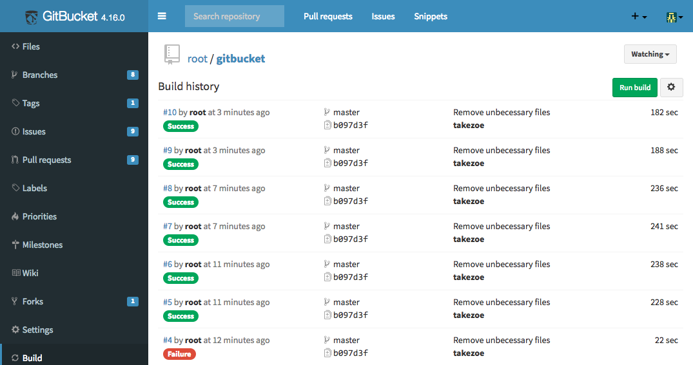

gitbucket-ci-plugin
========
GitBucket plug-in that adds simple CI ability to GitBucket.

This plug-in allows repository owners to configure build command, and run them at following timing:

- Push to the default branch
- Push to the pull request branch

However, you must not use this plug-in in public environment because it allows executing any commands on a GitBucket instance. It will be **a serious security hole**.

In addition, this plug-in is made to just experiment continuous integration on GitBucket easily without complex settings of webhook or Jenkins. It doesn't have flexibility and scalability, and also has a security issue which is mentioned above. Therefore, if you like it and would like to use for your project actually, we recommend to setup Jenkins or other CI tool and move to it.

## Versions

Plugin version | GitBucket version
:--------------|:--------------------
1.0.x          | 4.17.x -

## Installation

Download jar file from [the release page](https://github.com/gitbucket/gitbucket-gist-plugin) and put into `GITBUCKET_HOME/plugins`.

## Build

Run `sbt assembly` and copy generated `/target/scala-2.12/gitbucket-ci-plugin-assembply-1.0.0.jar` to `~/.gitbucket/plugins/` (If the directory does not exist, create it by hand before copying the jar).
